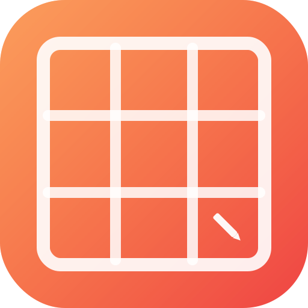

<p align="center">
  
</p>

<h1 align="center">Mirola's Grid Maker</h1>

<p align="center">
  <strong>Free online drawing grid overlay tool for artists</strong>
</p>

<p align="center">
  <a href="#features">Features</a> &bull;
  <a href="#demo">Demo</a> &bull;
  <a href="#tech-stack">Tech Stack</a> &bull;
  <a href="#getting-started">Getting Started</a> &bull;
  <a href="#contributing">Contributing</a>
</p>

<p align="center">
  
  
  
</p>

---

## What is Grid Maker?

Grid Maker is a free, open-source web tool that helps artists draw by overlaying a customizable grid on any reference image. Upload your photo, crop it, adjust the grid, apply filters, and download the result in high resolution.

Perfect for:
- Traditional artists using the grid method for proportional drawing
- Art students learning composition and proportions
- Anyone who wants to transfer a reference image to canvas accurately

## Features

- **Multiple image input methods** - Drag & drop, copy/paste (Ctrl+V), file picker, drag from browser, or paste a URL
- **Precision cropping** - Powered by Cropper.js with aspect ratio presets, rotation, flip, and zoom
- **Customizable grid** - 1-50 rows/cols, 10+ color presets, custom colors, adjustable thickness and opacity
- **Line styles** - Solid, dashed, or dotted lines
- **Grid extras** - Cell numbering with edge labels, center crosshair, diagonal lines
- **Image filters** - Original, Grayscale, Sepia, Scanner (high contrast B&W), High Contrast, Invert, Brightness, Warm, Cool
- **Simple & Advanced modes** - Toggle between basic controls and full configuration
- **High-res export** - Download as PNG or JPEG at 1x, 2x, or 3x scale
- **Grid-only export** - Export just the grid with transparent background
- **Dark & Light themes** - Smooth theme toggle with orange accent, defaults to dark
- **Multi-language** - English, Spanish, Portuguese, French with auto-detection
- **Responsive design** - Works on desktop and mobile, sidebar becomes bottom drawer
- **Resizable sidebar** - Drag to resize the sidebar width
- **Keyboard shortcuts** - Ctrl+V to paste, Enter/Esc in crop modal
- **SEO optimized** - Meta tags, JSON-LD, Open Graph, hreflang, sitemap
- **PWA ready** - Web app manifest for installable experience

## Demo

Visit **[mirola-grid-maker.vercel.app](https://mirola-grid-maker.vercel.app)** to try it live.

## Tech Stack

| Technology | Purpose |
|-----------|---------|
| [Svelte 5](https://svelte.dev) | UI framework with runes reactivity |
| [Vite 7](https://vitejs.dev) | Build tool & dev server |
| [Cropper.js](https://fengyuanchen.github.io/cropperjs/) | Image cropping |
| Canvas API | High-resolution export |
| SVG | Real-time grid overlay |
| CSS Custom Properties | Theming |

## Getting Started

### Prerequisites

- Node.js 18+
- npm or yarn

### Installation

```bash
git clone https://github.com/mirola777/grid-maker.git
cd grid-maker
npm install
```

### Development

```bash
npm run dev
```

Open [http://localhost:5173](http://localhost:5173) in your browser.

### Build

```bash
npm run build
```

The production build will be in the `dist/` directory.

### Preview production build

```bash
npm run preview
```

## Project Structure

```
grid-maker/
├── public/
│   ├── favicon.svg          # App icon
│   ├── og-image.svg         # Open Graph image
│   ├── manifest.json        # PWA manifest
│   ├── sitemap.xml          # SEO sitemap
│   └── robots.txt           # Crawler rules
├── src/
│   ├── main.js              # Entry point
│   ├── App.svelte           # Main layout & export logic
│   ├── components/
│   │   ├── ImageCanvas.svelte    # Image display & grid overlay
│   │   ├── Sidebar.svelte        # Controls panel
│   │   ├── CropModal.svelte      # Crop dialog with Cropper.js
│   │   ├── ThemeToggle.svelte    # Dark/light theme switch
│   │   └── LanguageSelector.svelte # Language picker
│   ├── stores/
│   │   ├── gridStore.js     # Grid state & theme store
│   │   └── i18n.js          # Internationalization
│   └── styles/
│       └── global.css        # Global styles & CSS variables
├── index.html               # HTML with SEO meta tags
├── vite.config.js
└── package.json
```

## Contributing

Contributions are welcome! Please feel free to submit a Pull Request.

1. Fork the project
2. Create your feature branch (`git checkout -b feature/amazing-feature`)
3. Commit your changes (`git commit -m 'Add amazing feature'`)
4. Push to the branch (`git push origin feature/amazing-feature`)
5. Open a Pull Request

## License

This project is licensed under the MIT License - see the [LICENSE](LICENSE) file for details.

## Author

**mirola777** - [GitHub](https://github.com/mirola777) | [Instagram](https://instagram.com/mirola777)

---

<p align="center">
  Made with ♥ by mirola777
</p>
